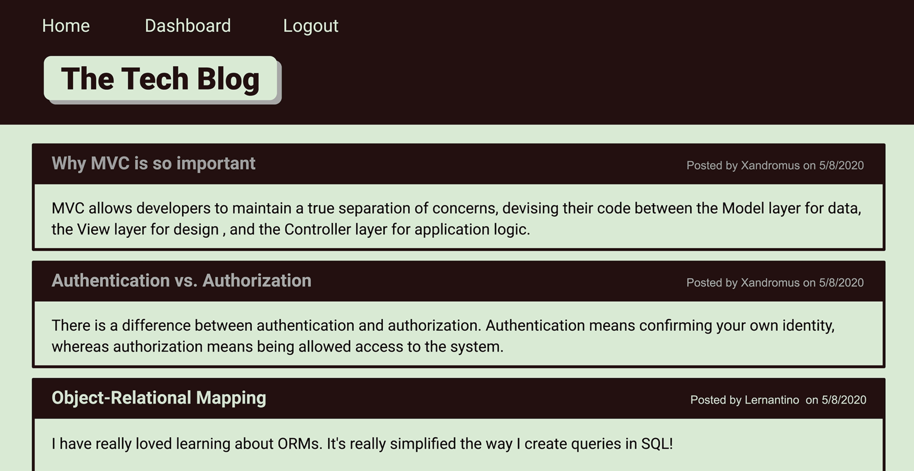

# Tech-Blog

Tech-Blog is a CMS-style blog site similar to a Wordpress site, where developers can publish their blog posts and comment on other developers. This app was built completely from scratch and deployed to Heroku. Tech-Blog follows the MVC paradigm in its architectural structure, uses Handlebars.js as the templating language, Sequelize as the ORM, and express-session npm package for authentication.

## **Steps to get started:**
```
- npm i (all dependencies)
- node server.js
```

## **Mock Up:**


## **Application Acceptance Criteria:**
```
```

## **Technology used:**
```
- Javascript
- Node.js
- Handlebars.js
- Sequelize
- Express-session
- MySQL2
- dotenv package
- bcrypt package
```

## **Steps for future development:**
```
- add more Javascript!
- successfully be able to add more than one employee
```
